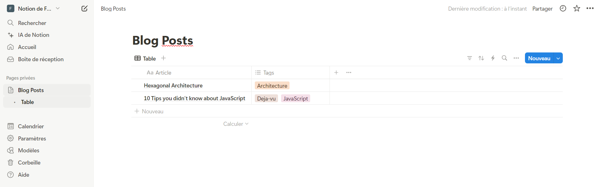
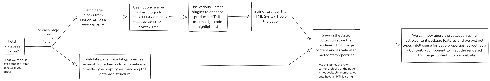

# notion-database-astro

## Basics

### Brief presentation of the new content layer API

`Content layer API` is a new feature (Astro V5 Beta) allowing you to define and query custom `Content Collections` (added in Astro V2).

- `Content Collection` was an easier way to manage local content using the `src/content` folder (md, mdx, ...). It provided a way to create collections of content sharing the same structure (blog posts, products, ...), using subfolders. In addition to the better organization, it was giving a better developer experience due to Intellisense and Typescript type-safety.

- `Content layer API` is a feature allowing to declare `loaders` which are custom functions to fetch content locally or remotely outside of the `src/content` folder. Note that remotely fetched content is cached, so Astro does not fetch it every time.

If you want to learn more, because I can't resume the documentation here, you can go to: [https://5-0-0-beta.docs.astro.build/en/guides/content-collections/]()

### The creation of our custom Notion loader

With the creation of the new content layer API, some loaders created by the community appeared, like the `notion-astro-loader`. But, unfortunately, it was not satisfying all our needs (we will discuss about motivations in the next section). So we made our own custom notion content loader, inspired by the existing community loader.

#### Motivations

If we had used `notion-astro-loader` directly:

- We are dependent on another library
- We have no control over the generated HTML content
- We can't easily extend the library and add new custom components
- It can have bugs (it's the case for picture generation for example)

### Setup of the communication with the Notion API

The notion loader needs to access the Notion API, so it needs a TOKEN. You can obtain it by configuring a new integration. Follow this tutorial to learn how to:

[https://developers.notion.com/docs/authorization#internal-integration-auth-flow-set-up]()

Next, you need to create a simple database (it's just a table in fact):

And you need to share it with our Notion integration (otherwise it will not be able to read the database content):

- Click on the three dots button in the top right corner of the web page
- Click on "Connect to"
- And search for the name of your integration (previously created)

## The loader conception

### How it works ?

A picture is worth a thousand words:

Some additional information:

- Notion has two different endpoints: one to list a database rows and one to retrieve the content of a page. You can't get the content of the pages by listing the database rows, you only get page IDs and metadata (called page properties in Notion vocabulary).

### Folders architecture

- Fetching: handle communication with the Notion API
- Rendering: handle HTML rendering of the different Notion blocks provided by the API, as well as the blocks tree as a whole (because, as a reminder, Notion blocks can be nested so they form a tree structure)
  - Notion Rehype: contains the Unified plugin to transform the Notion blocks tree into an HTML tree (we'll talk about it in more detail in the following sections)
- Schemas: contains schemas to define the expected output of a Notion page object
- Types: contains useful TypeScript types for the loader

### More explanations on HTML Rendering

#### What's Unified library ?

[Unified](https://github.com/unifiedjs/unified) is a library that "standardizes" and helps with the creation and manipulation of syntax trees. Through the usage of different plugins, it allows you, for example, to parse a Markdown file and convert it to HTML (and this is what Astro is using behind the scenes).

We invite you to read the Github page for a better understanding of its ecosystem.

#### Why not use components to render page content ?

We wanted to use Astro/React components at first because in my view:

- it is more maintainable
- allows easier handling of potential interactivity (a copy code button, for example)
- provides separation of concerns
- removes the need to use the Unified library (which is great but overwhelming in contrast to simple components)

However, we were dealing with the recommended way of doing things provided by Astro: The recommendation is to store the stringified HTML page content in the collection store and then render it using the `<Content />` component. Unfortunately, by doing this, we can't use a components system.

In addition, in the hypothesis that we didn't directly render the HTML content of the page and had passed the blocks tree to display it in some components, I think to get types intellisense it was necessary to create Zod schemas for each Notion blocks, which is very cumbersome. But maybe it is a lack of knowledge on my part.

Anyway, this is a subject to be developed further...
